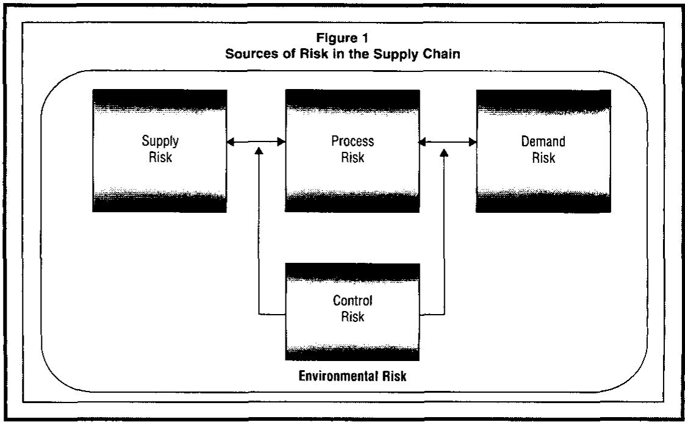
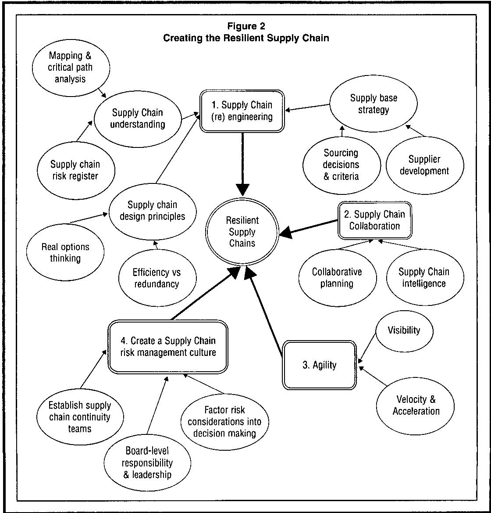
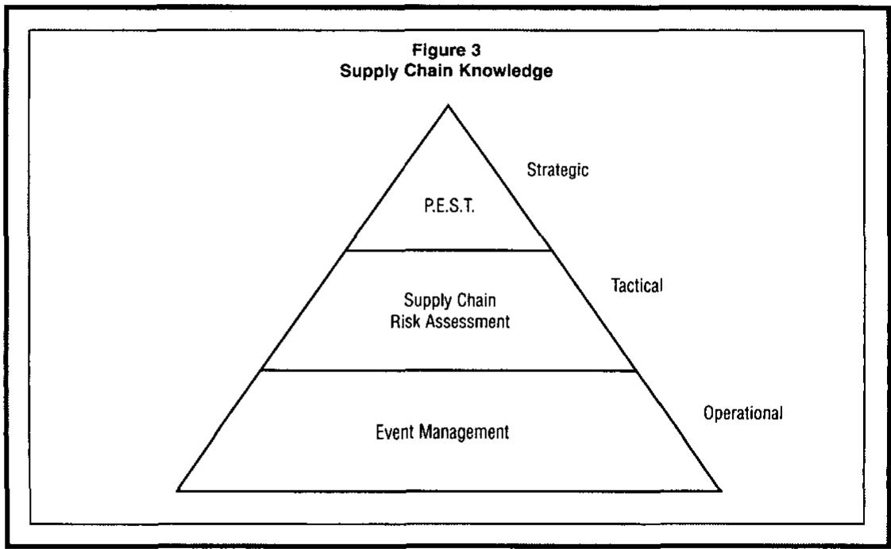

# Building the Resilient Supply Chain

Martin Christopher and Helen Peck

Cranfield School of Management

In today's uncertain and turbulent markets, supply chain vulnerability has become an issue of significance for many companies. As supply chains become more complex as a result of global sourcing and the continued trend to "leansing-down", supply chain risk increases. The challenge to business today is to manage and mitigate that risk through creating more resilient supply chains.

An agenda is presented for the identification and management of supply chain risk, with recommendations to improve the resilience of supply chains.

Supply chain managers strive to achieve the ideals of fully integrated efficient and effective supply chains, capable of creating and sustaining competitive advantage [1]. To this end they must balance downward cost pressures and the need for efficiency, with effective means to manage the demands of market-driven service requirements and the known risks of routine supply chain failures. Better management and control of internal processes together with more open information flows within and between organizations can do much to help.

However, in an age of lengthening supply chains serving globe-spanning operations, there are frequent reminders that we live in an unpredictable and changing world [2]. Natural disasters, industrial disputes, terrorism, not to mention the spectre of war in the Middle East, have resulted in serious disruptions to supply chain activities. In these situations "business as usual" is often not an option.

Modern commercial supply chains are in fact dynamic networks of interconnected firms and industries [3]. No organization is an island and even the most carefully controlled processes are only as good as the links and nodes that support them. All are dependent on efficient and reliable transportation and communication systems, a point, that is often overlooked [4].

These issues are the subject of the Centre for Logistics and Supply Chain Management's on-going program of research into supply chain risk and vulnerability. The work presented in this paper forms part of the wider body of research, funded by the UK's Department for Transport, which aimed to

increase the resilience of economic activity to all manner of potential threats [5].

In this paper, we report on some of the findings and recommendations of the second stage of that program. The work is empirically based and draws on insights from a number of important industries including food retailing, oil and petrochemicals, pharmaceutical, packaging, electronics, transport services and the distribution of automotive parts. It includes input from private and public sector organizations involved in the provision of health care and in defense. An agenda is presented for the identification and management of supply chain risk, with recommendations to improve the resilience of supply chains.

# Supply Chain Resilience

When working effectively and efficiently supply chains allow goods to be produced and delivered in the right quantities, to the right places, at the right time in a cost effective manner. Until recently the term "supply chain" was not widely used beyond the confines of academia, specialist sectors of industry and the professional management community. Now, in the wake of a number of far-reaching supply chain disruptions to economic activity it has crossed over into the everyday vocabulary of politicians, general managers and the wider public.

The term "supply chain" is itself a relatively new addition to the lexicon of management, first used in the early 1980s when writers coined the phrase to describe an emerging management discipline [6]. This new discipline was a response to changes in prevailing trends in business strategy, which

in turn demanded that internal functional self-interests be put aside to achieve a greater good - a more efficient organization, creating and delivering better value to customers and shareholders. It amounted to a redefinition and amalgamation of established business activities, notably "logistics" (integrated transport, warehousing, and distribution) and manufacturing-based "operations management". The latter drew together elements of purchasing, order and inventory management, production planning and control, plus customer service.

In the 1990s - the efficiency driven age of "business process reengineering" - supply chain management sought to speed the flow of goods and services by extending the integration of elements of logistics, operations management and marketing into cross-functional inter-organizational processes. The aim was to improve the efficiency of product flows from the production of raw materials through to the marketplace where finished goods were delivered to the final consumer. The task was enabled by rapid developments in information technology, which in turn opened the way for further improvements in efficiency and greater awareness of a changing marketplace and emerging customer requirements.

In practice legacies of functional biases within organizations, together with varying perspectives of specialist firms mean that the term "supply chain" continues to imply different things to different people. It is still frequently used to describe either the management of integrated manufacturing and/or logistics activities within a single firm's manufacturing, transport, distribution or retail network. It is also regularly applied (particularly in the context of purchasing) to describe the management and performance monitoring of an organization's supplier base, through quality improvement initiatives, involvement in new product introductions, promotions and overall cost reduction.

For the purpose of this paper we adopt an end-to-end perspective of the flows of product and accompanying information from the source of raw materials to delivery to the end customer and sometimes beyond (i.e., after-sales support and where necessary return). We therefore define a supply chain as: "the network of organizations that are

involved, through upstream and downstream linkages, in the different processes and activities that produce value in the form of products and services in the hands of the ultimate consumer" [7]. The notion of networks is particularly important and its relevance to this study will become apparent throughout this paper, but the key point is that modern supply chains are not simply linear chains or processes. They are complex networks. The products and information flows travel within and between nodes in a variety of networks that link organizations, industries and economies.

In defining other key terms in this paper we have veered away from hotly disputed academic definitions and sought where possible to align ourselves with appropriate and widely accepted dictionary definitions [8]. We have taken care to avoid some of the pitfalls of synonyms, in particular we distinguish between "resilience" and "robustness." In practice the two terms are used interchangeably, but in the context of supply chains they can acquire quite different connotations. To aid clarity we have adopted the following dictionary derived definitions. We have taken "robust" to mean "strong or sturdy in physique or construction." Here the emphasis is on physical strength. In IT terminology "robustness" is "the ability of a computer system to cope with errors during execution." A robust process may be desirable, but does not itself equate to a resilient supply chain. We are using the term "resilience" as it relates to supply chains as networks, so have adopted a dictionary-based definition that is rooted in the science of ecosystems. We define resilience as "the ability of a system to return to its original state or move to a new, more desirable state after being disturbed." The implication in this definition is the notion of flexibility, and given that the desired state may be different from the original, "adaptability" also earns a place in our thinking.

The final term we must deal with at this stage is potentially the most problematic of all. It is "risk." There are many different interpretations of risk in the academic literature. Among the most widely cited are variance-based definitions drawn from classical decision theory, where risk is the "variation in the distribution of possible

We define resilience as "the ability of a system to return to its original state or move to a new, more desirable state after being disturbed."

Given the interdependencies between organizations and their supply chains, it may be the business that is at risk from its supply chain or the supply chain that is at risk from a business.

outcomes, their likelihoods and their subjective values"; or the hazard-focussed interpretation, common in risk management, which is more likely to present risk in terms of: "Risk = Probability (of a given event) x Severity (negative business impact)" [9]. In this work we use risk in line with common usage in the sense that it relates to supply chain vulnerability, as "at risk: vulnerable; likely to be lost or damaged."

Given the interdependencies between organizations and their supply chains, it may be the business that is at risk from its supply chain or the supply chain that is at risk from a business. The predicament of Land Rover, a subsidiary of Ford, illustrates this point.

When chassis manufacturer UPF-Thompson became insolvent at the end of 2001, the impact upon its major customer was sudden and severe. UPF was the sole supplier of chassis for the Land Rover's bestselling model, the Discovery. The receivers, KPMG, threatened to halt supply unless Land Rover made an immediate up-front payment of between £35 and £40 million. KPMG justified its actions by pointing out that it was legally obliged to recover money on behalf of its creditors and the sole supplier agreement represented a valuable asset. The action followed an earlier court ruling in the UK that had determined that receivers were legally entitled to exploit a customer's vulnerability for the benefit of creditors. Land Rover faced the very real possibility of having to shut down production of the Discovery until a temporary injunction was secured granting the car-maker a short-term reprieve. The injunction allowed Land Rover to arrange for another supplier to acquire the failing business, averting the lay-off of 1400 Land Rover workers and many more among the car maker's network of suppliers.

That supply chain was at risk because of the failure of UPF's business, not directly due to a problem between the supplier and its automotive industry customers, but as a result of losses suffered by UPF in an unrelated but ill-starred foreign venture.

# Previous Research

Supply chain resilience is a new and still largely unexplored area of management research, though one that is currently in the ascendancy. This research follows on from an

exploratory study of Supply Chain Vulnerability by the Centre for Logistics and Supply Chain Management, undertaken in 2001 on behalf of the UK government's Department for Transport, Department of Trade and Industry (DTi) and the Home Office. The impetus for the study was the widespread economic disruption experienced in the UK by fuel protests in September 2000 and the outbreak of Foot and Mouth Disease in February 2001. The work was already well underway by the time of the terrorist attacks on the USA on September 11, 2001, though these events demonstrated the timeliness and relevance of the work.

The aim of the first study was to ascertain the state of knowledge within UK industry of the wider issue of Supply Chain Vulnerability, and where possible to identify "best practice" tools and approaches. A literature review provided a summary of current thinking in terms of risk management from the perspectives of the academic supply chain management community. This provided a working definition of supply chain vulnerability as "an exposure to serious disturbance, arising from risks within the supply chain as well as risks external to the supply chain." The distinction between risks internal and external to the supply chain is in practice an artificial one, though it offers a welcome point of reference in reviewing and positioning other bodies of work.

The study itself found that in the UK public sector, Emergency Planning and Management is a well-established discipline, the principles of which were laid down within local government during the Second World War. The Emergency Planning College, Easingwold, Yorkshire (www.epcollege.gov.uk) has an extensive holding of literature on the subject. Searches undertaken for this project confirmed that although issues of terrorist attacks on infrastructure were dealt with at length, specific references to disruptions to supply chains were conspicuously absent.

In the commercial sector (the primary focus of the report), companies had been aware of the need for crisis management and disaster recovery planning for some considerable time, though this was and remains primarily a single firm preoccupation. Concerns over the possible

impact of Y2K had done much to push the notion of inter-organizational dependency and a need for a more cohesive industry-wide approach to "Business Continuity", along a single dimension, that of IT.

The research concluded that the issue of supply chain vulnerability (and by implication that of supply chain resilience) lacked the necessary research base to comprehend a subject of this breath and importance. Furthermore, many organizations currently lacked an awareness of the need to consider the resilience of their supply chains as part of their overall approach to risk and business continuity management. Beyond that, the research concluded that a number of tools should be provided to assist organizations, large and small, in the identification and management of supply chain risks [10]. These conclusions have shaped the terms of reference for the subsequent program of research into "Supply Chain Resilience" that is the subject of this paper.

In the months between the commissioning of the first study, its publication and the subsequent research program, public sector Emergency Planning received renewed impetus in the UK and elsewhere around the world. For example, the UK Civil Contingencies Secretariat was established in July 2001, under the auspices of the Cabinet Office, to coordinate the different strands of government activity that quickly come into play as a crisis unfolds (www.ukresilience.info/role.htm).

In North America, the events of September 11, 2001 have since unleashed a flood of articles on supply chain risk and vulnerability. In the parlance of the first Cranfield report, the emphasis of this body of work is on the identification and management of risk external to the supply chain. In particular these articles discuss the need for and the implications of antiterrorism measures implemented by the US authorities, and their impact on domestic business and international trade [11]. The US-based industry association, the Council of Logistics Management has published a weighty report, entitled "Securing the Supply Chain." This report focuses on aspects of civil emergency and disaster management [12].

In academia, interest is growing in the study of risks internal to the supply chain.

Recent work in the UK, continental Europe and from the USA picks up various themes, much of them reflecting purchasing and supplier management concerns, including those associated with new product development. The emphasis of recent work is largely, though not exclusively, on the management of commercial risk principally in manufacturing industries [13]. Other research projects are now underway, though empirically based published work remains sparse.

During the course of this research program it became increasingly evident that modern supply chains are probably at greater risk than many of those who manage them recognize. While the existence of the many disturbances to the business environment, such as wars, epidemics and earthquakes, are readily acknowledged as sources of risk, it is less clear that the risks from within the supply/demand network are always apparent.

One of the fundamental issues is the lack of understanding of the wider supply demand network among managers. Supply chains still tend to be thought of as primarily "linear" structures. That is, product flows from one organization to another and eventually to an end-user. The reality is that the supply/demand network is more like a tree with a multitude of branches and a complex root system, with the trunk of the tree representing the processes of the focal firm [14].

It is essential that individual business entities and those who manage them understand the extent of the network of which they are a part and systematically explore the network to identify its vulnerabilities.

# Categorizing Risk

Supply chain risks can be categorized in many different ways and from different perspectives, such as from a corporate governance or financial risk agenda, or even in terms of a multi-level complex system [15]. However, based upon a framework originally proposed by Mason-Jones & Towill [16], we suggest that at its simplest there are three categories of risk which can be further subdivided to produce a total of five categories:

- Internal to the firm   
- Process   
- Control   
- External to the firm but internal to the

During the course of this research program it became increasingly evident that modern supply chains are probably at greater risk than many of those who manage them recognize.

supply chain network

- Demand   
- Supply

External to the network   
- Environmental

Figure 1 summarizes the linkages between these risk categories. Each of these five categories are briefly described below:

# Processes

These are the sequences of value-adding and managerial activities undertaken by the firm. The execution of these processes is likely to be immediately dependent on internally owned or managed assets and on a functioning infrastructure. Therefore, internally owned or managed assets and the reliability of supporting transportation, communication and infrastructure should be carefully considered. Process risk relates to disruptions to these processes.

# Controls

These are the assumptions, rules, systems and procedures that govern how an organization exerts control over the processes. In terms of the supply chain they may be order quantities, batch sizes, safety stock policies etc., plus the policies and procedures that govern asset and transportation management. Control risk is therefore the risks arising from the application or misapplication of these rules.

The next two categories are external to the focal firm, but remain internal to the inter-organizational networks through which materials, products and information flow. Ideally the focal firm should have an awareness of potential or actual disturbances to the anticipated flow of product and information from within and between every node or link in the supply chain networks through which its own value-streams flow. In practical terms this may not be possible, but the focal firm should at least strive to familiarize itself with those risks that are known or likely to affect adjacent organizations. It is unlikely that the focal firm will ever have intimate knowledge of all potential risks, though appropriate monitoring should increase the likelihood and provide early warning of actual events.

# Demand

Demand risk relates to potential or actual disturbances to the flow of product, information, and in this instance cash emanating from within the network, between the focal firm and the market. In particular, it relates to the processes, controls, assets and infrastructure dependencies of the organizations downstream and adjacent to the focal firm.

# Supply

Supply risk is the upstream equivalent of

the above, it relates to potential or actual disturbances to the flow of product or information emanating from within the network, upstream of the focal firm.

The fifth and final category relates to disruptions that are external to the network of organizations through which the value-streams/product supply chains flow.

# Environment

These events may directly impact upon the focal firm or on those upstream or downstream, or indeed on the marketplace itself. They may affect a particular value stream (i.e., product contamination) or any node or link through which the supply chain passes (i.e., as the result of an accident, direct action, extreme weather or natural disasters). They may be the result of socio-political, economic or technological events many miles or organizations removed from the focal firm's own supply chains, but may have carry-over effects through linkages to other industry networks. The type or timing of these events may be predictable (i.e., those arising from regulatory changes), but many will not be, though the impact of these types of events may still be assessed. However, our research revealed instances where organizations had every opportunity to identify forthcoming disruptions, but either failed to do so. The industrial action affecting the US West Coast ports in 2002 was one such example. Well ahead of the actual events the likelihood of disruptions was discussed in the press and on television news channels. The same channels later reported the massive disruptions to supply chains experienced by those who did not head the warnings.

A further issue which adds to supply chain risk is that upstream and downstream "visibility" is often very poor. In other words there is frequently only a limited exchange of information between adjacent entities in a network. For example a supplier to an original equipment manufacturer (OEM) may have no information on the rate of sale that the manufacturer is achieving, only receiving sporadic orders with the expectation that delivery can be made within an ever-shorter timescale. The reality is that most organizations are "forecast-driven" rather than "demand-driven" and are forced to take decisions in isolation of each other. While

this lack of shared information is a source of considerable additional cost to the supply chain as a whole, it is also a significant source of vulnerability.

There is often a significant "disconnect" in organizations between the determination of business strategy and the recognition of the impact of those strategic decisions upon supply chain vulnerability. For example many companies have moved from domestic to global sourcing in search of lower unit costs. However, that definition of cost is too limited - it does not always take account of the increased risk to the supply chain through extended/lead-times, reliance on partners who themselves may be vulnerable to external events or the potential loss of control.

The need for formalized procedures for supply chain risk management within and between organizations emerges very strongly from this research. The findings of the empirical study revealed that practitioners frequently struggle to come to terms with the scope and variety of potential risks. Consequently, many were unable to readily identify appropriate tools and techniques which might be employed to manage the panoply of potential risks. Furthermore, while some form of business continuity planning exists within most large businesses, business continuity management has been slow to take into account the risks that emanate from the wider supply/demand network. It is our contention that many of the threats to business continuity lie outside the focal firm, hence the need for a much broader perspective when it comes to contingency or continuity planning.

Based upon these conclusions what actions should be taken?

# Creating the Resilient Supply Chain

Emerging from our research program was a number of discernible general principles that underpin resilience in supply chains. Most echo rather than contradict the widely accepted principles of good supply chain management.

First, it seems that resilience should be designed in. In other words there are certain features that, if engineered into a supply chain, can improve its resilience.

The second general principle is that because supply chains generally extend across different corporate entities there will

The need for formalized procedures for supply chain risk management within and between organizations emerges very strongly from this research.

The message that needs to be understood and acted upon is that the biggest risk to business continuity may well come from the wider supply chain rather than from within the business.

need to be a high level of collaboration if risk is to be identified and managed.

Third, resilience implies agility. Being able to react quickly to unpredictable events is a distinct advantage in an uncertain environment.

Finally, resilience in the supply chain will be enhanced, and indeed made possible, by the creation of a risk management culture in the organization. The message that needs to be understood and acted upon is that the biggest risk to business continuity may well come from the wider supply chain rather than from within the business. The remainder of this paper briefly examines these four key principles, as summarized in Figure 2.

# Supply Chain (re) Engineering

Conventionally supply chains have often

been designed to optimize for cost and/or customer service, rarely was resilience the "objective function" for the optimization process. Given the risks to which modern supply chains are exposed this may need to change. A number of recommendations are suggested to provide the basis for the design of supply chains with risk reduction in mind.

Supply Chain Understanding. A fundamental pre-requisite for improved supply chain resilience is an understanding of the network that connects the business to its suppliers and their suppliers and to its downstream customers. Mapping tools can help in the identification of "pinch points" and "critical paths."

Pinch points will often be characterized as bottlenecks where there is a limit of capacity and where alternative options may

not be available i.e., ports capable of taking large container vessels or central distribution facilities which if they were to become inoperable would place a heavy strain on the rest of the system.

A critical path in the supply chain/network may have one or more of the following characteristics:

- Long lead-times, that is the time taken to replenish components from order to delivery.   
- A single source of supply with no short-term alternative.   
- Linkages where "visibility" is poor, for example, little or no shared information between nodes.   
- High levels of identifiable risk such as supply, demand, process, control and environmental risk.

The results of this risk assessment exercise should also be used to create a supply chain risk register where the vulnerabilities of critical nodes and links in the network are noted and procedures for their monitoring and subsequent mitigation and management defined.

Supply Base Strategy. While there has been a move towards the reduction of the supplier base in many companies, there may be limits to which the process should be pursued. Single sourcing, where one supplier is responsible for the supply of a specific item or service may be advantageous from a cost and quality management perspective, but is dangerous in terms of resilience. While it may be desirable to have a lead supplier, wherever possible alternative sources should be available. Where a firm has multiple sites it may be possible to have a single source for an item or service into each site thus gaining some of the advantages of single sourcing without the downside risk. Similarly if a manufacturing firm makes a range of products it may be possible to single source by product thus keeping an alternative source of supply available.

It is strongly advocated that one of the key criteria for the selection of suppliers should be the risk awareness of the supplier. For example have they audited their own supply chain risk profile? Do they have procedures in place for the monitoring and mitigation of risk? It may be appropriate for the company to adopt a pro-active strategy of

supplier development to work closely with key suppliers to help them improve their supply chain risk management practices.

Supply Chain Design Principles. A number of principles have emerged from our research, which should be considered when (re) engineering supply chains to improve resilience:

- Choose supply chain strategies that keep several options open. This may not be the lowest cost course of action in the short term but may provide an opportunity to reduce the impact of a disruption if and when it occurs. There is an analogy here with "Real Options Theory" in investment planning. Thus a strategy that is based around centralization of distribution facilities may be the lowest cost option but it could also shut down other options and hence increase vulnerabilities.   
- Re-examine the "efficiency vs. redundancy" trade off. Conventionally surplus capacity and inventory have been seen only as "waste" and are therefore undesirable. However, the strategic disposition of additional capacity and/or inventory at potential "pinch points" can be extremely beneficial in the creation of resilience within the supply chain. The trade-offs inevitably involve the judgemental balancing of the cost handicap involved in maintaining slack "just-in-case", against the probability and likely impact of a negative event. Not a message that hard pressed corporate executives are necessarily willing to hear. Nevertheless, if resilience is to be taken seriously, surplus capacity may well be the lesser evil, being more flexible than inventory, which may already be committed to its final form or destination. Both capacity and inventory can provide "slack" in a supply chain to enable surge effects to be coped with. Inventory, carried in a generic or semi-configured form, can enable the creation of a "de-coupling point" which, together with additional capacity (i.e., production, transport, people), can enable demand uncertainty to be more effectively managed. While not advocating a return to the days of buffering every stage in the supply chain with safety stock or excess capacity, we do suggest that the strategic and selective use of "slack"

It is strongly advocated that one of the key criteria for the selection of suppliers should be the risk awareness of the supplier.

may be fundamental to supply chain resilience.

# Supply Chain Collaboration

It will be apparent that since supply chain vulnerability is by definition a network-wide concept, the management of risk has to be network-wide too. A high level of collaborative work across supply chains can significantly help mitigate risk. The challenge is to create the conditions in which collaborative working becomes possible. Traditionally supply chains have been characterized by arms-length, even adversarial, relationships between the different players. There has not been a history of sharing information either with suppliers or customers. More recently, however, there have been encouraging signs that a greater willingness to work in partnership is emerging in many supply chains. In the fast moving consumer goods (FMCG) industry there is now significant collaboration between manufacturers and retailers in the form of Collaborative Planning, Forecasting and Replenishment (CPFR) initiatives [17].

The underlying principle of collaborative working in the supply chain is that the exchange of information can reduce uncertainty. A key priority for supply chain risk reduction has to be the creation of a supply chain community to enable the exchange of information between members

of that community. The aim is to create a high level of "supply chain intelligence" whereby there is a greater visibility of upstream and downstream risk profiles and changes in those profiles.

Supply chain intelligence is the phrase we have coined to describe the process of using knowledge generated and shared by partners in the supply chain. The type of knowledge that can aid the creation of supply chain resilience pertains to the identification of sources of risk and uncertainty at each node and link in the supply chain. Supply chain knowledge might also be categorized as strategic, tactical and operational (see Figure 3).

Strategic knowledge is an awareness of trends and emerging issues that may have an impact on supply chain continuity at some point in the future. This type of knowledge can be generated through formal "P.E.S.T." type analysis (political, economic, social and technological). Such analyses are intended to enable a formalized appraisal of the context within which networks and supply chains operate.

At the tactical level the knowledge required is specific to the assessment of risk to current operations; primarily demand, supply, process and control risk.

The third level of knowledge is operational and pertains to the day-to-day management of the business. The emerging

A key priority for supply chain risk reduction has to be the creation of a supply chain community to enable the exchange of information between members of that community.

field of Supply Chain Event Management (SCEM) is potentially of great value in this regard [18].

# Agility

Supply chain agility can be defined as the ability to respond rapidly to unpredictable changes in demand or supply. Many organizations are at risk because their response times to demand changes or supply disruption are too long. Agility has many dimensions and it relates as much to networks as it does to individual companies. Indeed, a key to agile response is the presence of agile partners upstream and downstream of the focal firm. Two key ingredients of agility are "visibility" and "velocity."

Supply Chain Visibility. Put very simply, supply chain visibility is the ability to see from one end of the pipeline to the other. Visibility implies a clear view of upstream and downstream inventories, demand and supply conditions, and production and purchasing schedules for example. It also implies internal visibility with clear lines of communications and agreement on "one set of numbers."

Visibility in a supply chain can be obscured by the presence of intervening inventories upstream and downstream of the focal firm. These intervening inventories are usually created independently of each other as a result of decision rules, the basis of which may not be readily apparent. Visibility will be further distorted by the presence of the bullwhip effect [19] that can magnify small changes in marketplace demand as it moves back up the supply chain.

The achievement of supply chain visibility is based upon close collaboration with customers and suppliers as well as internal integration within the business.

Collaborative planning with customers is important to enable visibility of demand to be gained but also for information to be shared on market trends and perceptions of risk. Equally, upstream visibility also requires high levels of collaborative planning with suppliers and the use of "event management" logic to enable alerts of potential supply disruptions to be signalled.

A significant barrier to supply chain

visibility is often encountered within the focal firm's internal organization structure. The presence of "functional silos" inhibits the free flow of information leading to "second guessing" and a general lack of communication. This situation is often exacerbated when the company has internal suppliers or customers with limited integration between them. The challenge here is to break down these silos to create multi-disciplinary, cross-functional process teams.

Supply Chain Velocity. The second ingredient of supply chain agility is velocity. Velocity is defined as distance over time. Hence to increase velocity, time must be reduced. Here we are referring to "end-to-end" pipeline time that is the total time it takes to move product and materials from one end of the supply chain to the other. End-to-end pipeline time - as it relates to agility - can be measured as the elapsed time from when the focal firm places orders on its first tier suppliers to when it delivers to its customers. It is not just velocity that matters in the creation of agile supply chains, it is acceleration. In other words how rapidly can the supply chain react to changes in demand, upwards or downwards?

There are three basic foundations for improved supply chain velocity and acceleration: streamlined processes, reduced in-bound lead-times and non-value added time reduction.

Streamlined processes are simplified processes in that they have been engineered to reduce the number of stages or activities involved, they are designed to perform these activities in parallel rather than in series and they are e-based rather than paper-based. At the same time these streamlined processes are designed around minimal batch sizes – be they order quantities, production batch sizes or shipping quantities. The emphasis is on flexibility rather than economies of scale.

The second key ingredient to enhanced velocity in supply chains is a reduction in inbound lead-times. One of the criteria for the choice of supplier and the source of supply should be their ability to respond rapidly in terms of delivery and to be able to cope with short-term changes in volume and mix requirements.

Synchronization of schedules based on

Supply chain agility can be defined as the ability to respond rapidly to unpredictable changes in demand or supply.

shared information enables suppliers to become more agile without necessarily having to rely on inventory as a buffer with all its consequential problems.

The third building-block in achieving velocity improvements comes from reducing the non-value adding time in the pipeline. Most time spent in a supply chain is not value-adding from a customer perspective. More often than not it is idle time measured as inventory. That inventory is itself generated as a result of cumbersome processes - every day of process time requires at least a day of inventory to cover during that lead-time.

# Creating a Supply Chain Risk Management Culture

In the same way that many organizations recognized that the only way to make Total Quality Management (TQM) a reality was to engender a culture that made quality the concern of everyone, today there is a requirement to create a risk management culture within the business. We would argue that this culture of risk management should extend beyond the boundaries of corporate risk and business continuity management to become "supply chain continuity management."

As in every case of culture change at an organizational level, nothing is possible without leadership from the top of the organization. One of the key conclusions of our research is that supply chain risks present the most serious threat to business continuity and yet as our research revealed, paradoxically, not every company has supply chain management represented in its own right in the Board Room. If the supply chain has a voice at all at that level it is often represented through IS/IT Directors or Vice-Presidents. While this can work, it is often the case that in such instances the understanding of what constitutes supply chain risk is limited to an information systems based perspective.

It can also be argued that supply chain risk assessment should be a formal part of the decision making process at every level. For example, when new products are at the design stage, issues of supply chain vulnerability such as component availability and lead times should be considered. When changes in business strategy are contemplated such as a move to off-shore sourcing from

domestic sourcing, then the resulting supply chain risk profile should be assessed.

A supply chain risk management team should be created within the business and charged with regularly updating the supply chain risk register and to report to the Board through the supply chain director on a least a quarterly basis. The team will need to be cross-functional and be able to audit risk using the frameworks and tools we have put forward in this report.

# Limitations and Further Research

This paper draws on the empirical evidence contained in earlier UK government funded research into supply chain vulnerability, together with that presented in other recently published studies. From the evidence contained in this limited but expanding pool of work the need for a structured approach to the management of supply chain risk was identified. The paper sets out a framework for improved supply chain risk identification based on a process control perspective, assisting the manager in identifying sources of risk, in terms of their location relative to the focal firm. The authors recognize that other approaches to the segmentation and identification of supply chain risk are presented within the literature cited, but not from a normative managerial perspective as is the intention here. The exploration of these other approaches is beyond the scope of this paper. The routemap framework for supply chain resilience is put forward in the same spirit, drawing as appropriate on widely accepted principles of demand-driven supply chain management together with useful perspectives borrowed from risk management in other spheres, including finance.

The likelihood that costs will be incurred in maintaining supply chain redundancy "just-in-case" is acknowledged. However, an analysis of the short and long-term costs associated with measures, such as the application of real options thinking, must be left for other authors to pursue in greater detail. Similarly, the exact trade offs between the different risks associated with make or buy decisions, or the quality and other cost-related benefits of single sourcing, when set against the potential losses should that source of supply fail, fall beyond the scope of this

When changes in business strategy are contemplated such as a move to off-shore sourcing from domestic sourcing, then the resulting supply chain risk profile should be assessed.

work. It is left to others to tackle these essential bottom line questions. The authors accept that, ultimately, these questions will have to be answered if the commercial community is voluntarily to sacrifice short term cost optimization in favor of improved and sustainable supply chain-wide resilience.

# Conclusion

Our research has highlighted the risks to business continuity that lie in the wider supply chain. The trends towards the creation of increasingly complex networks of interdependent organizations - through strategies of out-sourcing and globalization in particular - have heightened some of these risks.

Many organizations have not fully recognized the nature of systemic supply chain risk and have continued to focus on seeking efficiency improvements through "lean" solutions. However, a new priority has emerged for business planning. This priority has to be the search for supply chain strategies that embody a significantly higher degree of resilience.

Resilience implies flexibility and agility. Its implications extend beyond process redesign to fundamental decisions on sourcing and the establishment of more collaborative supply chain relationships based on far greater transparency of information. These are major challenges to business leaders in every industry which urgently require attention.

# References

[1] Christopher, Martin, Denis Towill, "Developing Market Specific Supply Chain Strategies", International Journal of Logistics Management, Vol. 13, No. 1 (2002), pp. 1-13   
[2] Peck, Helen, Uta Juttner, "Risk Management in the Supply Chain", Focus, December, 2002, pp. 17-22.   
[3] Hakansson, H. and I. Snehorta, "No Business is an Island: The Network Concept of Business Strategy", Scandinavian Journal of Management, Vol 5, No. 3 (1989), pp. 187-200.   
[4] Peck, Helen, "Reconciling Supply Chain Vulnerability with Risk and Supply Chain Management", Proceedings of the Logistics Research Network Conference, Dublin, (2004), pp. 412-419.   
[5] Creating Resilient Supply Chain: A

Practical Guide, Cranfield, Cranfield University (2003). Available electronically at www.cranfield.ac.uk/som/scr.   
[6] Oliver, R. K., M.D. Webber, "Supply Chain Management: Logistics Catches up with Strategy" in Christopher, M. Logistics, the Strategic Issues, London, Chapman and Hall, (1992).   
[7] Christopher, Martin, Logistics and Supply Chain Management, Pitman Publishing, London, (1992).   
[8] Collins English Dictionary, Harper Collins, Glasgow, (2000).   
[9] March, J.G., Z. Shapira, "Managerial Perspectives on Risk and Risk Taking", Management Science, Vol. 33, No. 11 (1987), pp. 1404-1418.   
[10] Cranfield School of Management, Supply Chain Vulnerability, Final Report on behalf of DTLR, DTi and Home Office, (2002).   
[11] Sheffi, Yossi, "Supply Chain Management Under Threat of International Terrorism", International Journal of Logistics Management, Vol. 12, No. 2 (2002), pp. 1-11 and Lee, Hau and M. Wolfe, "Supply Chain Security Without Tears", Supply Chain Management Review, Vol. 6, No. 1 (2003), pp. 12-20.   
[12] Helferich, Omar, Robert Cook, Securing the Supply Chain, Council of Logistics Management, Oakbrook, Illinois, (2002), pp. 316.   
[13] Svensson, Goran, "Dyadic Vulnerability in Companies' Inbound and Outbound Logistics Flows", International Journal of Logistics and Research Applications, Vol. 5, No. 1 (2002), pp. 13-44.   
[14] Lambert, Douglas M., Supply Chain Management: Processes, Partnerships, Performance, Sarasota, FL: Supply Chain Management Institute, 2004, p. 8.   
[15] Peck, Helen, "Understanding the Sources and Drivers of Supply Chain Risk" in The Financial Times Handbook of Management, 3rd edition, London: Pearson Publishing, 2004.   
[16] Mason-Jones, Rachel, Denis Towill, "Shrinking the Supply Chain Uncertainty Cycle", Control, September, 1998, pp. 17-22.   
[17] Ireland, Rom, Robert Bruce, "CPFR: Only the Beginning of Collaboration", Supply Chain Management Review, Vol. 6, No. 5

Resilience implies flexibility and agility. Its implications extend beyond process redesign to fundamental decisions on sourcing and the establishment of more collaborative supply chain relationships based on far greater transparency of information.

(2002), pp. 80-88.   
[18] Otto, Andreas, "Supply Chain Event Management: Three Perspectives", International Journal of Logistics Management, Vol. 14, No. 2 (2003), pp. 1-11.

[19] Lee, Hau, V. Padmanabhan, Seungjin Whang, "The Bullwhip Effect in Supply Chains", Sloan Management Review, Vol. 38, No. 3 (1997), pp. 93-102.

Martin Christopher is Director of the Cranfield Centre for Logistics and Supply Chain Management and also the Marketing Group at the Cranfield School of Management, Cranfield University, UK. He has held appointments as Visiting Professor at the Universities of British Columbia, Canada, New South Wales, Australia and South Florida, USA. Professor Christopher is a Fellow of the Chartered Institute of Marketing and of the Chartered Institute of Logistics, & Transport, on whose council he sits. In 1987, he was awarded the Sir Robert Lawrence medal of the Institute of Logistics & Transport for his contribution to the development of logistics education in Britain. He has worked as a consultant for major international companies in North America, Europe, the Far East and Australasia. He can be reached at Cranfield School of Management, Cranfield University, Cranfield, Bedford, England, MK43 0AL, Tel: +44 (0)1234 754183, e-mail: m.g.christopher@cranfield.ac.uk

Helen Peck is a Senior Research Fellow at the Cranfield Centre for Logistics and Supply Chain Management (CLSCM). Her specialist area of interest is supply chain risk and resilience, which she has pursued in recent years as lead researcher, co-author and project manager for CLSCM's UK government-funded program of research into supply chain resilience. Her publications to date include numerous papers, journal articles, as well as co-editor and authorship of several books and reports. She is also an award-winning writer of management case studies. Helen teaches supply chain risk on graduate and in-company programs at CLSCM and at The Royal Military College of Science. She is a regular speaker at academic, business and defense conferences. She can be reached at Cranfield School of Management, Cranfield University, Cranfield, Bedford, England, MK43 0AL, Tel: +44 (0)1234 751122, e-mail : h.peck@cranfield.ac.uk