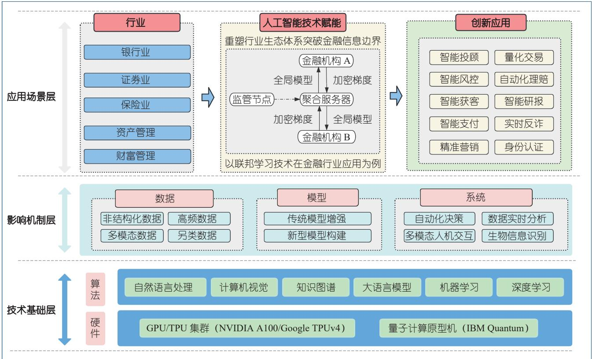
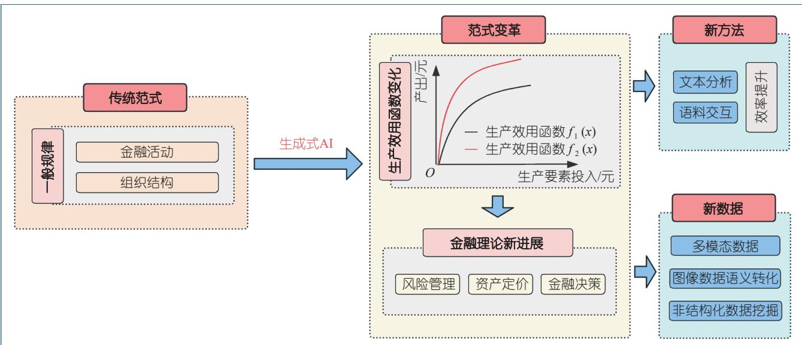

# 人工智能增强金融系统：应用场景与发展趋势

郭海凤 赵津艺

西南财经大学

在全球数字化转型的宏观背景下，金融行业正处于以人工智能（artificial intelligence, AI）技术为核心驱动 力 的 新 一 轮 科 技 革 命 前 沿 。AI的 概 念 最 早于1956 年由约翰·麦卡锡（John McCarthy）在美国达特茅斯学院举办的夏季学术研讨会上提出，其核心思想是“学习的每一个方面或智能的任何特征都可以被精确描述，并最终由机器模拟实现”[1]。这一愿景奠定了AI的两大流派：基于符号 AI专家系统的象征主义者和基于人工神经网络的联结主义者。20世纪 80年代末，反向传播算法（back propagation, BP）的优化和深度神经网络（deep neural networks, DNN）的出现，使得联结主义进一步发展。AI技术的演进不仅依赖算法创新，更得益于计算硬件的升级和海量数据的积累，使得深度学习（deep learning, DL）能够高效训练多层神经网络，推动 AI 在计算机视觉（computer vision, CV）、自然语言处理（natural language processing, NLP）等领域产生了革命性进展。如今，AI已从早期的专家系统演变为数据驱动的深度学习，并进一步向通用人工智能（artificial general intelligence, AGI）迈进，为金融等行业的智能化转型奠定了技术基础。

金融系统本质上是典型的复杂系统，其特征表现为多主体异质性、非线性相互作用以及动态网络化结构，传统线性模型难以捕捉如金融危机中的级联效应等复杂系统特征，而 AI 技术通过对金融市场数据的非线性时序特征与网络关联性进行识别、自适应决策建模模拟异质主体的策略演化、结合复杂网络分析识别关键节点预警系统性风险等技术路径，推动金融行业

向更高效、更稳定的方向发展。近年来，AI 与金融的深度融合发展正深刻重构全球金融业的竞争格局，AI技术不断渗透到金融业的各个应用场景（见图 1），推动构建金融业智能化发展生态。AI对金融业具有降本增效的核心价值，根据英伟达（NVIDIA）公司发布的《2025年 金 融 服 务 业 中国 AI 现 状 与 趋 势》报 告，2024 年已有 $40 \%$ 的中国金融机构正在使用或评估生成式人工智能（generative AI, GenAI）技术，该比例较2023 年增长了 $6 0 \% ^ { [ 2 ] }$ 。这一结果源自微观企业需求和宏观政策引导的双重作用。2023年 10月召开的中央金融工作会议强调，金融是国民经济的血脉，要加快建设金融强国，切实做好科技金融、绿色金融、普惠金融、养老金融、数字金融“五篇大文章”[3]。而以技术驱动的金融科技是实现金融业高质量发展的重要抓手，是深化金融供给侧结构性改革、增强金融服务实体经济能力的重要引擎。2024年 12月，中央经济工作会议明确提出开展“人工智能 $+ ^ { ; }$ ”行动[4]，AI 技术使机器具备执行传统上依赖人类认知任务的能力，涵盖基础性重复劳动乃至高阶复杂决策，在多模态数据自动提取、处理和挖掘上展现出强大的处置潜力，有助于充分发挥数据作为生产要素的作用，为金融行业的数字化转型注入充沛新动能，推动经济社会智能化发展。

当前，金融与 AI的融合已跨越“金融 $+$ AI”的工具辅助阶段，进入“AI+金融”的驱动变革新周期。本文首先剖析 AI在银行、证券、保险等细分场景的应用，进而分析大模型技术对于金融生态的影响效应，接着探讨AI对金融理论的颠覆性改变，最后展望未来 AI技术在金融领域应用的发展趋势。通过这一脉络，揭示从“金融+AI”到“AI+金融”的产业演变路径。

  
图 1   AI技术增强金融系统的应用架构

# AI在传统金融细分领域的应用场景

AI是数据、计算能力和技术三者的有机结合，金融行业作为典型的数据密集型产业，在日常业务开展过程中积累了海量的用户及交易数据，为 AI技术的应用提供了良好基础。银行、证券、保险等传统金融产业在政策引导和自身发展需求的双重作用下进一步加速与 AI技术的融合趋势（见表 1）。在金融业务场景中，

AI技术的应用主要集中在一些业务流程相对简单且非决策环节的关键部位，其核心目标是借助 AI 的强大能力，最大限度地降低风险、降低成本、提升效率，同时为客户提供更加精准、个性化的金融服务。当前，AI技术主要通过CV、机器学习、知识图谱、智能语音、NLP、机器人流程自动化（robotic process automation, RPA）及大语言模型（large language model, LLM）等技术路径改变传统金融行业服务模式，提升业务运营水平。

表1     AI 技术在金融细分行业主要应用场景  

<table><tr><td>行业</td><td>主要应用场景</td></tr><tr><td>银行业</td><td>知识图谱全景信用评价、风险智能预警和处置、反欺诈检测、智能投顾、企业关系挖掘、客户行为预测与精准营销、生物识别无感支付</td></tr><tr><td>证券业</td><td>人脸识别开户、证件识别验证、办公助手、客户咨询自动回复、反洗钱、关联交易分析、财经新闻情感分析、智能合同审查、监管文件自动解析</td></tr><tr><td>保险业</td><td>智能投保评估、智能营销推广、智能产品设计、自动化材料审核、智能理赔</td></tr><tr><td>投资与资产管理（证券投资基金、 风险投资、私募股权投资等）</td><td>智能投研、报告纪要自动生成、算法交易、投资组合优化、市场风险预测、内部知识管理、多层次图谱检索公司信息、智能估值、智能选股</td></tr></table>

AI有效解决了以往金融行业在传统运营中存在的诸多业务痛点。首先，AI技术的应用，如智能客服机器人等，能够提供全天候、高效、精准地提供客户服务，突破了传统模式下人工服务的瓶颈。其次，AI技术通过流程自动化、智能决策等手段，实现了业务流程的优化和效率的大幅提升。此外，AI技术能够对金融机构未

充分利用的非结构化数据进行有效处理和分析，打破信息孤岛，实现数据的整合与共享，从而提升金融机构的数据管理水平和风险识别能力。目前，AI的大模型技术实现语言、视觉、语音等多模态数据的分析应用，利用金融业务产生的海量常规数据和卫星图像、图片及语音信息、非结构化文本等非常规数据，发挥逻辑推

理能力优势，对于智能化赋能金融行业具有重要意义。

# AI技术赋能银行业

根据花旗集团（Citigroup）的报告 AI in Finance:Bot, Bank & Beyond，预计到 2028 年，AI 可以将全球银行业的利润推高到 2万亿美元，未来五年将增长$9 \% ^ { [ 5 ] }$ 。AI 技术在银行业的应用场景包括智能风控、智能投顾、智能获客和智能支付等领域。

# 智能风控

风险控制是银行的核心要务，目的是避免由于信息不对称带来的损失。AI技术可以实现在事前对客户的全景信用评价，在事中对高风险交易、异常可疑交易等的动态捕捉和智能预警，在风险发生后的智能化快速响应和有效处置。在智能信贷方面，AI技术突破了传统风控中对于人主观性经验的依赖，通过多维关系图谱、特征提取、智能化评价，在评估风险时更好地进行用户分析。深度学习驱动的信用评估模型可以从海量的数据项和众多变量中获取大量数据，通过建立多个信用风险预测子模型，生成综合信用评分。同时，AI技术能够结合多维度数据更好地捕捉到中小企业的发展潜力和融资需求，缓解银企之间的信息不对称问题。欺诈会给银行带来财务和声誉上的双重打击，在智能反欺诈领域，AI技术能够结合多维度数据对异常交易进行推断，例如银行可以基于社区算法、关联图谱、图神经网络（graph neural networks, GNN）等 AI 技术训练模型，对可疑账户和团伙进行实时动态监测，识别团伙欺诈或身份冒用[6]。风险发生后，借助 AI实施自动化交易拦截、账户冻结和漏洞补救等应对措施，同时对风控模型及风险控制策略进行优化迭代，推动风险管理从“人防”向“技防”和“智控”转变，增强风险处置的及时性与准确性。

# 智能投顾

AI技术在银行业智能投顾中的应用，主要是通过自动化、数据驱动的投资建议，极大地提升客户服务的效率和专业性。随着基于 NLP的聊天机器人和基于多模态交互的语音助手的应用普及，银行的客户运营、产品推介变得更加智能，并且能够突破地域限制，提供全天不间断的专业服务。该场景利用语音识别（automaticspeech  recognition,  ASR） 和 语 音 合 成 （ text-to-speech,TTS）技术，通过对文字、语音和图像等用户交互信息的深层次挖掘，让用户体验到更加个性化的投顾服务。此外，基于 AI技术的智能投顾通过减少人工干预，降

低了投资咨询的成本，使更多投资者能够获得专业的投资建议。对于从业人员，智能投顾在一定程度上解决了机械性高度重复咨询、内外部知识更新沉淀等匹配问题，从而提升银行的运营效率。

# 智能获客

一个完整的获客流程包括客户识别、营销和推送等步骤，基于用户画像和行为数据，AI技术能够生成个性化的产品推荐和服务，有效实现精准触达和高效转化。根据客户的基础信息、风险偏好等数据挖掘用户潜在需求，进行行为预测和精准营销。随着投资者数据、产品知识和营销文案的不断积累，AI利用强化学习方法，能够整合资料库中的营销话术和金融语料，根据不同类型的消费者进行精准推断，并生成相应的图文推广方案。智能获客系统将更加注重多模态交互，通过语音、文本等多种方式与客户进行沟通，提供更加便捷和人性化的服务，在确保尊重消费者意愿和保护其合法权益的基础上，精准推送消费者所期望和所需要的金融产品、理财知识以及服务信息。

# 智能支付

AI在智能支付领域的应用主要是基于 CV与多模态学习深度融合的生物识别无感支付。CV技术可以用于提取人脸的生物特征并与证件进行比对，确认支付过程中的身份核对，保障用户账户和资产安全；同时，生物验证简化了用户在传统支付和转账过程复杂的验证流程，提供了更加安全便捷的支付服务。AI技术通过声纹识别使得声纹支付成为可能，通过比较包含声音声学特征（主要特征包括音调、响度和音色）的声纹来分离声音，进行身份的一对一识别。例如，招商银行将声纹识别技术集成于智能识别云平台系统的小额支付、转账、自助查询等场景[7]。此外，AI 技术还可以建立行为生物特征识别系统，分析用户行为，实现智能支付。例如渣打银行通过长短期记忆（long short-term memory, LSTM）神经网络持续学习用户的滑屏力度、触控热区等维度行为特征，构建动态身份认证模型。

# AI技术赋能证券业

AI 技术已应用于证券业的前中后台全场景。

# 前台客户服务

AI技术可以实现与用户的智能化交互沟通，优化用户体验，降低服务成本。开户是证券公司进行业务推广的第一步，AI 技术可以实现智能开户，通过人脸识别技术对用户的身份信息进行远程核验，实现用户开

户信息的集中管控和备案。此外，光学字符识别（optical character recognition, OCR）技术结构化实现信息抽取、文件分类、内容检索和材料自动化审核，实现用户信息和人脸信息的绑定。AI 技术还可以分析客户的浏览记录、投资行为、应用程序足迹等信息，对用户的基本情况进行评估，推送最符合用户需求的资产和相关资讯。AI系统根据上述资产配置策略智能化构建投资组合，用户可以根据自身偏好进行投资决策。

# 中台投资管理

AI技术可以建立实时用户档案，对用户集群行为进行可视化分析，对于客户集群面临的相似问题进行集中解决，实现自动做市和资产服务。在资产管理方面，AI技术可以基于财经新闻、情感分析等手段识别出潜在的市场波动，利用情绪分析、舆情监控和非结构化数据进行投资组合的优化。

# 后台风险管理

AI技术正深度重构证券行业的风控体系，通过AI技术实时监控全市场交易数据，智能测算多维度风险敞口。利用 NLP与知识图谱技术，自动解析监管政策文件，实现智能合同审查。在反洗钱监测方面，图神经网络可动态识别隐蔽的关联交易网络，同时深度学习模型可持续学习最新监管规则，自动生成合规报告，构建了穿透式、智能化的全面风险管理屏障。

# AI技术赋能保险业

AI技术可以广泛应用于保险业的业务全流程，包括用户评估、产品设计与营销、自动化理赔等领域。

# 智能投保评估

保险业的核保环节传统上依赖人工审核、历史数据和静态规则，效率低且存在主观偏差，AI技术的引入正在显著提升核保的精准性、效率和用户体验。AI 技术可以对客户的健康状态进行投保前的科学评估和后续的持续追踪跟进，例如当前已被平安、忠利保险等15家中国和国际保险公司应用的保险科技产品可以利用用户 30 s的自拍视频对用户心率等健康数据进行测量，综合评估客户的健康状况[8]。

# 智能产品设计

通过机器学习算法分析海量用户数据和实时市场信息，AI系统能够快速识别潜在风险点和市场需求，智能生成定制化保险产品方案。例如，基于深度学习的预测模型可精准测算不同人群的出险概率，实现动态差异化定价。数据驱动式的保险产品设计有助于实现

保险产品与用户需求的精准匹配，通过分析用户的可穿戴设备数据，保险公司可以为用户提供个性化保费优惠，提升保险产品对于客户的吸引力。

# 智能营销推广

在保险业智能营销推广领域，基于大模型的智能系统能够自动生成个性化营销文案、海报和视频内容，实现针对不同年龄段客户进行保险方案差异化展示。同时通过对话式 AI实现 $2 4 \mathrm { ~ h ~ }$ 在线的智能客服，不仅能即时解答客户咨询，更能基于年龄、收入、家庭结构等数据智能生成的用户画像，推荐最优保险组合，大幅降低了获客成本并提升了服务体验。这种“智能内容生成 $^ +$ 精准推荐”的营销新模式，正在重塑保险业的客户触达和转化路径。

# 自动化理赔

基于 CV的智能定损系统可通过车主上传的事故照片自动识别车辆损伤部位和程度，结合增强学习算法实时计算维修方案和赔付金额，实现远程自动化定损。同时，NLP技术能自动解析医疗票据、事故报告等材料，通过知识图谱核验信息真实性。这种标准化处理减少了人为操作误差和欺诈风险，提升保险理赔效率，缩短理赔时间。

# AI技术赋能投资与资产管理

AI技术被广泛应用于公募基金、私募基金和私募股权投资（private equity, PE）、风险投资（venture capital,VC）等股权投资机构的投研过程中。

# 智能投研

在智能投研领域，AI技术可以在海量研报、新闻、市场行情信息获取有效信息，并实现观点融合，提升投资人的信息摄入密度和信息处理效率，利用大模型技术生成研报内容精华，并与原文中的图表进行拼接。在会议、路演等场景中，大模型可以利用多模态资源进行信息的自动化提取和梳理总结，全面及时洞察市场、精准预判未来趋势，提升行业研究的效率和准确性，节约信息搜集时间，实现降本增效。大模型技术有助于实现金融机构内部的知识复用，实现便捷化的信息调用，减 少 低 效 率 的 重 复 劳 动 。 大 模 型+LightRAG技术可以对基金报告信息提取和分析，包括从表格中提取基金收益等数值，以及对基金经理展望等文本进行文本分析，LightRAG 可以对实体和关系进行自动化抽取，多层次检索获取的信息辅助大模型生成回答。当前也出现了 AI 创投基金，可以基于海量数据和丰富

的知识储备综合判断公司发展前景，根据相关评估结果自动化地给予资金支持，有利于金融支持科技型企业的发展。

# 智能投资

在对被投企业进行估值时，传统的估值模型有许多参数需要假定，而这一过程常常依赖于投资人的主观经验，使用 AI技术可以对这些参数进行预测，得到更加客观合理的公司估值。对于证券投资基金，AI 技术应用于个股技术分析和投资组合优化等领域，尤其在量化交易领域发挥着重要作用。在技术分析中影响因子众多，可以利用提示工程使用大模型生成相应的技术分析报告。量化交易高度依赖于数据和对于市场的实时分析，AI在量化交易模型的设计、参数判断和策略回测过程中具有重要优势，且 AI具有自适应的技术特点，可以实现量化交易模型的便捷迭代。

# 生成式人工智能重塑金融行业生态

近年来 GenAI的快速发展，显著增强了 AI技术的信息处理能力，开始重塑金融行业的生态体系。2023年被称为 GenAI的突破之年，推动通过学习现有数据生成新的数据，实现类人的创造力。GenAI 最广泛使用的形式之一是 LLM，旨在根据自然语言提示生成连贯且上下文适当的文本。当前市面上主要的大模型产 品 包 括 ChatGPT、 GPT-4、 Claude-3.5、 Gemini-1.5、OpenAI-o1、 DeepSeek-R1 等 ， 2025 年 DeepSeek 的出现实现了技术平权，获得了全球的广泛关注。DeepSeek通 过 在 模 型 层 引 入 稀 疏 化 的 混 合 专 家（mixture of experts, MoE）架构、采用 FP8 精度训练、利用多词元预测（multi-token prediction, MTP）即多词元（token）生成提高训练效率，以及独创的群组相对策略优化（group relative policy optimization, GRPO）算法等技术创新手段，实现了较低的算力开销。以 DeepSeek-V3 为例，其应用程序编程接口（application programminginterface,  API）定价不足同类竞品的十分之一。且DeepSeek具 有 开 源 的 优 势，使 得 机 构 广 泛 地将DeepSeek模型部署到机构内部环境成为可能，根据自身业务特点对模型进行针对性地训练，防止数据和隐私泄露。

随着 GenAI 技术从“单一的语言生成”逐步向“多模态 AI”发展，金融行业的生态将变得更加智能化、高效化和个性化，多模态 AI合并了许多数据模态，例如

文本、照片、视频和音频，以提供对场景的更透彻的理解，为金融机构和客户创造更大的价值。以大模型为例，“AI+金融”主要体现为 2种途径：一种是通用模型 $^ +$ 金融语料训练金融大模型，该类模型基于强大的通用语料库和技术优势（例如更长的上下文长度处理能力、多模态、模型微调定制、更高的速率限制等），因此，在实时性、客户受众方面具有很好的优势；此外，其注重嵌入性（embeddings）以及与其他软件的结合，这也助推了其在包括金融领域在内的场景业务的推广度。在金融领域中，GPT系列、文心一言、通义千问、腾讯混元以及科大讯飞表现较好。另一种是金融垂类大模型，该类模型基于强大的金融专业型的数据基础，领域针对性强，金融数据质量更高、金融类数据量更丰富；因此，对金融行业分析和决策的适用性和准确性更强。该类模型注重金融垂直业务场景的细分化；因此，该类模型要求使用者对金融业务知识理解更深刻，金融业务专业性要求更高。行业已涌现出多个代表性案例：彭博社开发的 BloombergGPT通过优化模型架构显著提升了金融自然语言处理任务的性能，包括情感分析、命名实体识别、新闻文本分类以及智能问答系统等核心场景。与此同时，国内也相继推出本土化解决方案，比如 AI4Finance Foundation 研发的 FinGPT、奇富科技自主研制的“奇富 GPT”、度小满发布的国内首个千亿参数规模中文金融大模型“轩辕”等开源模型，腾讯云推出了金融行业定制化大模型解决方案，恒生电子开发了 LightGPT轻量化模型，蚂蚁集团发布了专注于金融垂直领域的蚂蚁金融大模型等。这些实践不仅验证了大模型技术在金融场景的适用性，也为行业提供了差异化的技术路径选择[9]。

从整体上看，GenAI 显著提升了基础服务的素质，通过智能化的客户互动、个性化的服务推荐和实时的数据分析，为客户提供更加高效、便捷和个性化的金融服务体验。同时，GenAI在提升基础生产效率方面也发挥了重要作用，通过自动化处理大量重复性任务，如数据录入、文件处理、风险评估等，减少了对低端劳动力的依赖，优化了资源配置效率。这种优化不仅降低了运营成本，还使得金融机构能够将更多资源投入到高价值的业务领域，如创新产品研发、高端客户服务和风险管理等。此外，GenAI 通过减少冗余性和重复性劳动，显著提高了劳动生产力。例如，在客户服务领域，智能客服系统能够实时响应客户咨询，提供准确的解答和建议，极大地提高了客户满意度；在风险评估和合规检查方面，AI 模型可以快速处理大量数据，识别潜在

风险，提高决策的准确性和效率。这些技术的应用不仅提升了金融机构的运营效率，还增强了其市场竞争力，使其能够在激烈的市场竞争中脱颖而出。同时，GenAI有助于降低投资者获取专业信息的门槛，提升投资者的专业知识水平和辅助决策，有助于提升市场有效性，实现金融行业的高质量发展。

多模态、生成式的 AI 技术正在成为金融领域的重要驱动力。通过整合多种数据类型（如文本、图像、语音等）生成新的数据集，为金融分析提供了更丰富的信息来源。例如，通过 GenAI生成的合成数据，金融机构可以模拟各种市场情景，进行更精准的风险评估和投

资策略测试。此外，金融领域的研究方法也在不断向前迈进。多模态、生成式的 AI 技术的应用引发了金融系 统 中 金 融 决 策 和 资 产 定 价 等 理 论 的 进 一 步 发展（见图 2）。AI 实现了对传统金融活动的颠覆，促进信用中介、信息收集、风险定价、投资决策等金融活动智能化、标准化、自动化发展，推进了对智能化金融模式的相关研究。通过 GenAI 生成的市场数据，可以用于验证和改进现有的资产定价模型，推动金融理论的创新和发展。这种技术的应用不仅提高了金融决策的科学性和准确性，还为金融市场的稳定和高效运行提供了新的理论支持。

  
图2    生成式AI 变革传统金融研究范式

# 结束语

金融行业正在由“金融+AI”向“AI+金融”的方向转型。在过去“金融+AI”模式中，AI主要作为辅助工具，帮助金融机构提高效率、优化服务。然而，随着技术的不断进步，AI逐渐成为金融业务的核心驱动力，推动金融业务模式的创新和变革。当前，以智能体（Agent）为代表的应用框架使得大模型正在加速与各领域进行融合[10]，增强大模型应用的自主任务执行能力。未来，AI在金融行业的应用可能采取决策中枢大模型与专业执行垂直模型协同的多智能体联合运作分工模式。在这种模式下，决策中枢大模型将负责整体的战略决策和资源分配，而专业执行垂直模型则专注于特定领域的具体任务执行。例如，决策中枢大模型可以基于宏观经济数据和市场趋势，制定整体的投资策略；而专业执行垂直模型则负责具体的投资组合管理、风

险控制和客户服务等任务。这种分工模式不仅能够提高决策的科学性和准确性，还能提升整体运营效率，使得金融机构能够更好地应对复杂多变的市场环境。 ■

# 郭海凤

西南财经大学金融学院金融科技系主任、教授。主要研究方向为金融科技、监管科技、公司金融。guohf@swufe.edu.cn

# 赵津艺

西南财经大学金融学专业硕士研究生。主要研究方向为金融科技、风险投资、创新。zjymichelle@163.com

# 参考文献

Eliza StricklandS. The Turbulent Past and Uncertain Future[1] of AI: Is there a Way out of AI’s Boom-and-Bust Cycle?[J]. IEEE Spectrum, 2021, 58(10): 26−31.   
英伟达. 2025 年金融服务业中国 AI 现状与趋势 [R/OL].[2](2025−05−27)[2025−08−18].  https://www.199it.com/archives/1758972.html.  
新华社. 中央金融工作会议在北京举行 习近平李强作重[3]要讲话 [EB/OL]. (2023−10−31)[2025−08−18]. https://www.gov.cn/yaowen/liebiao/202310/content_6912992.htm.  
人民日报. 中央经济工作会议在北京举行 [N]. 人民日报,[4]2024−12−13(1).  
Citigroup.  AI  in  Finance:  Bot,  Bank  &  Beyond[EB/OL].[5] (2024−06)[2025−08−18]. https://www.citifirst.com.hk/

home/upload/citi_research/rsch_pdf_30255539.pdf.   
金融电子化. 新型网络诈骗犯罪场景下的反欺诈安全[6][EB/OL].  (2024−01−16)[2025−08−18].  https://mp.weixin.qq.com/s/ZA6Dx2Z7zUkZPCrrQzFpMA.  
招 商 银 行 .  生 物 识 别 技 术 应 用 推 动 服 务 模 式 创 新[7][EB/OL].  (2019−03−18)[2025−08−18].  https://www.fintechinchina.com/cases/830.  
丁铎, 冯雨奇, 金严喆, 等. 人工智能在金融场景中的应用[8] 综 述 [EB/OL].  (2021−09−27)[2025−08−18].  https://fmba. pbcsf.tsinghua.edu.cn/info/1027/118.htm.   
胡 翔 .  AI+金 融 大 模 型 的 两 条 技 术 路 线 [EB/OL].[9](2024−02−23)[2025−08−18]. https://pdf.dfcfw.com/pdf/H3_AP202402231623414857_1.pdf?1708853370000.pdf.  
华泰证券金融工程. Deepseek+投研: 大模型应用集锦[10][EB/OL].  (2025−03−01)[2025−08−18].  https://www.53ai.com/news/OpenSourceLLM/2025030107928.html.

# Artificial Intelligence-Enhanced Financial Systems: Applications and Development Trends

Haifeng Guo, Jinyi Zhao

Southwestern University of Finance and Economics

Abstract: Artificial intelligence (AI) has broad applications in financial systems, significantly enhancing the fundamental productivity and labor  efficiency  of  the  financial  industry.  This  article  comprehensively  reviews  the  applications  of  AI  in  traditional  financial  sectors, including  its  role  in  empowering  banks  with  intelligent  risk  control,  robo-advisory  services,  smart  customer  acquisition,  and  automated payment systems. Furthermore, AI demonstrates extensive application scenarios and demand in securities, insurance, private equity, funds, and  investment  industries.  The  article  also  provides  an  in-depth  analysis  of  how  generative  AI,  particularly  large  financial  models,  is reshaping the financial sector. This article argues that generative AI elevates the overall quality of foundational services, improves production efficiency, reduces reliance on low-end production lines and service labor, and optimizes resource allocation. By minimizing redundant and repetitive tasks, it enhances labor productivity. Consequently, the financial industry is transitioning from a “Finance $^ +$ AI” model to an “AI + Finance” paradigm.  Moreover,  multimodal  and  generative  AI  technologies  are  expected  to  generate  new  data,  advancing  novel  research methodologies  in  finance.  This  evolution  will  drive  theoretical  progress  in  financial  decision-making,  asset  pricing,  and  other  key  areas within financial systems.

Keywords: artificial intelligence; FinTech; intelligent risk control; generative artificial intelligence; financial large models; multi-modal data

摘　要：人工智能在金融系统中具有广泛的应用场景并显著提高金融业的基础生产效率和劳动生产力。本文全面梳理人工智能在传统金融产业中的应用，包括人工智能赋能银行进行智能风控、智能投顾、智能获客、智能支付；在证券行业、保险行业以及私募、基金、投资等各行业均具有丰富的应用场景与应用需求。文章同时分析了生成式人工智能中的金融大模型如何重塑金融行业。作者认为生成式人工智能从整体上拉升基础服务素质，全面提升基础生产效率，减少低端生产线和服务业的投入，优化资源配置效率；降低冗余性和重复性劳动，提高劳动生产力。因此，金融行业由“金融 $+ .$ AI”正在向“AI+金融”的方向转型。此外，多模态、生成式的人工智能技术会进一步产生新的数据，促进金融领域新的研究方法向前迈进，由此引发金融这一复杂系统中的金融决策、资产定价等理论向前发展。

关键词：人工智能；金融科技；智能风控；生成式人工智能；金融大模型；多模态数据

中图分类号：F83; TP399

中文引用格式：郭海凤, 赵津艺. 人工智能增强金融系统：应用场景与发展趋势 [J]. 计算, 2025, 1(5): 49−55.

英文引用格式： Haifeng  Guo,  Jinyi  Zhao.  Artificial  Intelligence-Enhanced  Financial  Systems:  Applications  and  Development  Trends[J]. Computing Magazine of the CCF, 2025, 1(5): 49−55.